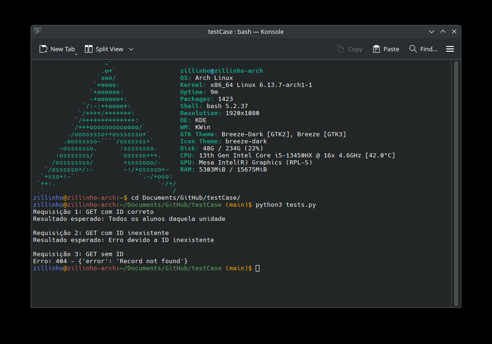

# README.md

Para utilizar uma aplicação real, utiliza-se a API da sala.

## Caso de Teste: Pegar alunos de uma unidade

### Objetivo:

O objetivo desse teste é mandar requisições para o endpoint `/institutions/{id}/students/` que deve retornar todos os alunos daquela unidade.

### Pré-Condição:

A pré-Condição é que o id da unidade seja conhecido e que a API esteja funcionando perfeitamente. 

### Procedimento:

O teste fará diversas requisições e seus resultados esperados são diferentes:

- **Requisição 1:** `GET /institutions/{id}/students/` com o parâmetro de ID correto.
- **Requisição 2:** `GET /institutions/{id}/students/` com um ID inexistente.
- **Requisição 3:** `GET /institutions/{id}/students/` sem passar nenhum parâmetro como ID.

### Resultados Esperados:

- **Requisição 1:** Deve retornar todos os alunos daquela unidade. (HTTP 200)
- **Requisição 2:** Deve retornar um erro devido de ID inexistente. (HTTP 404)
- **Requisição 3:** Deve retornar um erro devido de ID não recebido. (HTTP 400)

### Resultados Obtidos:

 

- **Requisição 1:** Success 200: Todos os alunos daquela unidade 
- **Requisição 2:** Erro 404: ID inexsitente 
- **Requisição 3:** Erro 404: ID inexistente.

As requisições 1 e 2 foram bem sucedidas, pois o resultado esperado foi o mesmo do obtido. Já na requisição 3, o resultado obtido foi diferente do esperado, pois o erro foi 404 e não 400. Isso implica que a API não possui um tratamento correto caso a requisição seja feita sem o parâmetro ID.